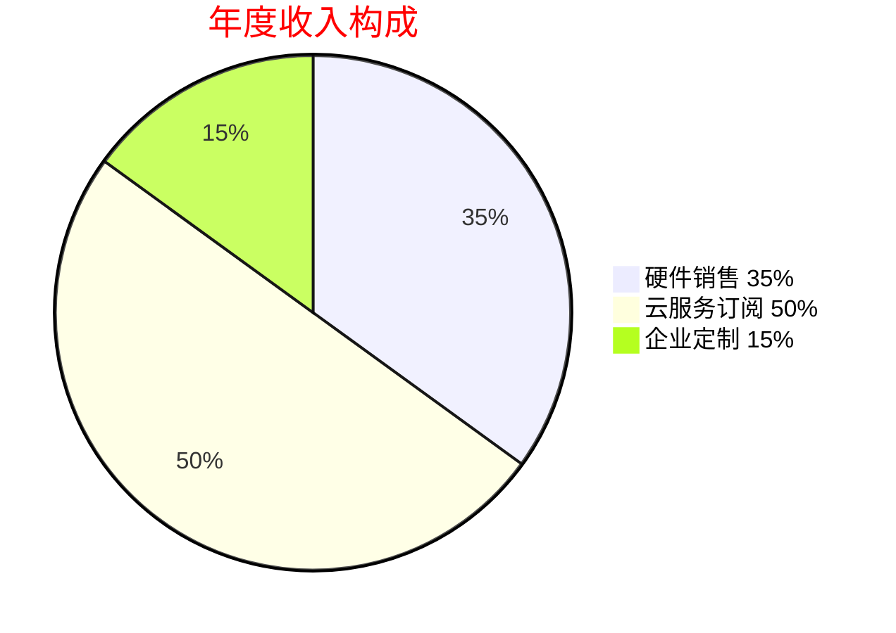

# 盈利模式

## 1. 战略定位与价值转化

### 1.1 硬件入口+服务生态

| 战略定位             | 技术实现                                                                 | 商业价值                              |
|----------------------|--------------------------------------------------------------------------|---------------------------------------|
| 硬件入口+服务生态     | 自研中枢模块（支持MQTT/HTTPS协议） 跨品牌设备互联网关           |主打淘宝硬件销售占比：35%  企业定制占比：15% 云服务ARR（年度经常性收入）占比：50% |

### 1.2 开源硬件增值

| 战略定位             | 技术实现                                      | 商业价值                              |
|----------------------|-----------------------------------------------|---------------------------------------|
| 开源硬件增值          | 兼容ESP32/RPi MCU生态 双语言SDK（Python/C++） | 开发者社区规模目标：2万+ 硬件复购率提升至：50% |

---

## 2. 收益结构

