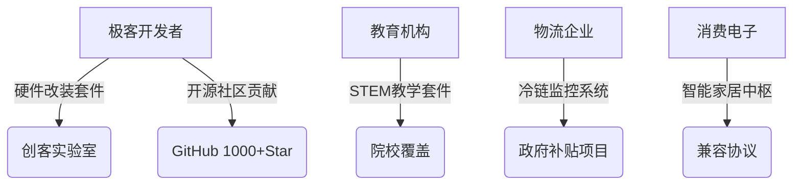

# 开放式 IoT 平台架构 - 技术白皮书

> ​**科技驱动未来 · 开放赋能创新**  
> *更新时间：2025-03-31 | 版本：v0.1 |*

 

## Ⅰ 核心价值体系
### 1.1 基于开放式架构的技术栈
| 创新维度         | 技术实现路径                                                                 | 商  业  价  值  |
|------------------|----------------------------------------------------------------------------|------------|
| ​**硬件民主化**    | 基于Raspberry Pi Pico/Pico2构建MCU生态链， 兼容ESP32/Lucky Fox等异构硬件       | 降低采购成本 |
| ​**开发低门槛**    | 预集成AES-256/SHA-2加密算法， 提供多种标准化API接口                            | 减少研发成本|
| ​**生态开放性**    | 支持MQTT/HTTPS双协议栈， 无缝对接云端IoT平台                                   | 缩短对接周期|

### 1.2 市场战略定位
