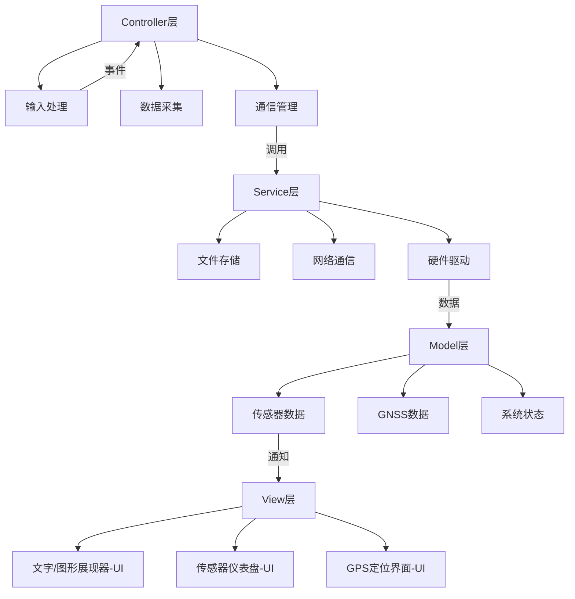

# 系统架构设计

## 核心架构设计

### MVCS层次架构图

### 基于MVCS架构的层次映射方案
=== "Model层（**数据核心**）"
    - MessageModel：硬件日志、参数配置等核心数据
    - HWCheckModel: 硬件健康状态检测
    -  SensorModel：封装温湿度原始数据及其校准算法
    -    GNSSModel：处理GNSS坐标原始数据及坐标系转换逻辑
    -    CommModel：维护网络连接状态和MQTT/HTTP/HTTPS
=== "View层（**显示系统**）"
    -   DisplayView：整合双缓冲机制和区域渲染策略
    - StatusBarView：信号强度、时间等系统状态显示
    -    ConfigView：设备配置界面的可视化呈现
    -    SensorView：温湿度数据的图形化展示
    -      GNSSView: GNSS数据的图形化展示
=== "Controller层（**业务逻辑**）"
    -  InputController：整合键盘/UART输入处理
    - SensorController：协调传感器数据采集周期
    -   GNSSController：管理定位数据更新策略
    -   CommController：处理消息编解码与QoS策略
    - RenderController：调度显示刷新与动画过渡
=== "Service层（**底层通讯服务**）"
    -    FileService：文件读写操作
    - NetworkService：MQTT/HTTP/HTTPS连接管理
    -  SensorService：传感器驱动封装
    -    GNSSService：GNSS定位模块通信协议
    -  DeviceManager: 统一管理硬件资源分配/提供硬件访问的标准化接口