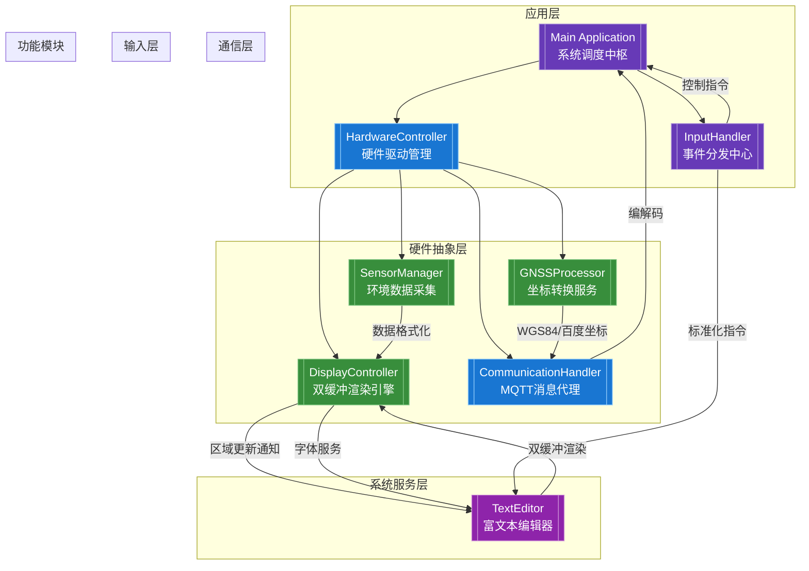

# 嵌入式系统架构设计

## 核心架构设计

### 程序模块架构

```mermaid
%% 主程序架构图
flowchart TD
    subgraph 应用层
        MA[["Main Application<br/>系统调度中枢"]] --> HC
        MA --> IH
    end

    subgraph 硬件抽象层
        HC[["HardwareController<br/>硬件驱动管理"]] --> DC
        HC --> SM
        HC --> GP
        HC --> CH
    end

    subgraph 系统服务层
        DC[["DisplayController<br/>双缓冲渲染引擎"]] -->|区域更新通知| TE
        DC -->|字体服务| TE
        SM[["SensorManager<br/>环境数据采集"]] -->|数据格式化| DC
        GP[["GNSSProcessor<br/>坐标转换服务"]] -->|WGS84/百度坐标| CH
    end

    subgraph 通信层
        CH[["CommunicationHandler<br/>MQTT消息代理"]] -->|编解码| MA
    end

    subgraph 输入层
        IH[["InputHandler<br/>事件分发中心"]] -->|标准化指令| TE
        IH -->|控制指令| MA
    end

    subgraph 功能模块
        TE[["TextEditor<br/>富文本编辑器"]] -->|双缓冲渲染| DC
    end

    classDef appLayer fill:#673AB7,stroke:#B39DDB,color:#ffffff;
    classDef hardwareLayer fill:#1976D2,stroke:#90CAF9,color:#ffffff;
    classDef serviceLayer fill:#388E3C,stroke:#81C784,color:#ffffff;
    classDef module fill:#8E24AA,stroke:#CE93D8,color:#ffffff;

    class MA,IH appLayer;
    class HC,CH hardwareLayer;
    class DC,SM,GP serviceLayer;
    class TE module;
```
## 依赖关系
###Main Application 协调所有核心模块
###HardwareController 提供硬件抽象层
###DisplayController 作为显示服务中枢
###各功能模块通过 DisplayController 输出内容
###箭头方向表示服务依赖关系